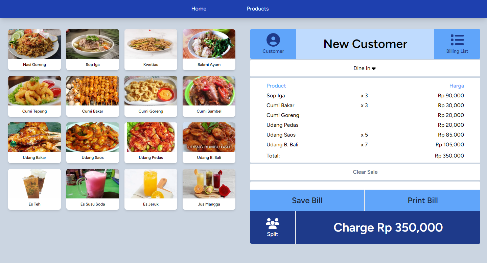

## POINT OF SALES (Laravel, React JS, TailwindCSS)

#### Nama: Aditya Erlangga Wibowo
#### Backend: Laravel 10
#### Frontend: ReactJS + TailwindCSS

## Demo

## LINKS

 - [Link Website](https://pos.adityaerlangga.me)
 - [Link Repositori](https://github.com/adityaerlangga/laravel-react-point-of-sales)

## Authors

- [@adityaerlangga](https://www.github.com/adityaerlangga)

